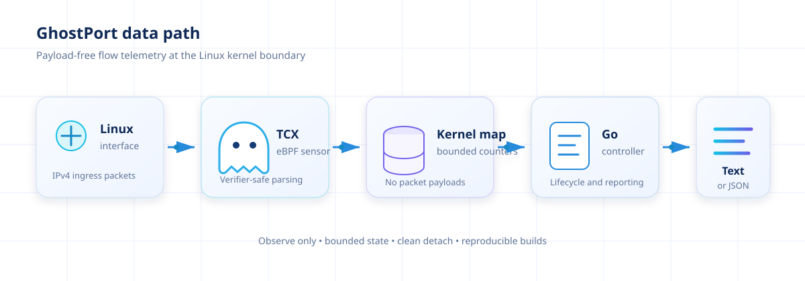

# GhostPort


[](https://github.com/Naina9760/ghostport/actions/workflows/ci.yml)
[](https://github.com/Naina9760/ghostport/actions/workflows/release.yml)

GhostPort is a lightweight Linux network sensor. It attaches an eBPF traffic
classifier to a network interface, reports IPv4 packet counts grouped by
source address, destination address, protocol, and destination port, and can
alert on vertical and horizontal port-scan patterns in that traffic.

This repository currently targets the second milestone (v0.2: detection).
Decoy services, fleet coordination, authenticated alert delivery, and a
dashboard are planned separately; the current sensor should not yet be
described as a complete honey-mesh.

## Architecture



## Requirements

- Linux kernel 6.6 or newer with BPF and TCX support
- Root or the capabilities required to load and attach BPF programs
- Go 1.25 or newer
- Clang/LLVM with the BPF target
- Linux and libbpf development headers

On Ubuntu or Debian, install the native build dependencies with:

```sh
sudo apt-get update
sudo apt-get install -y clang llvm libbpf-dev linux-libc-dev
```

## Build

```sh
make build
```

The resulting executable is `bin/ghostport`. The build recompiles the eBPF
object from `cmd/ghostport/ghostport.bpf.c` before building the Go controller.

## Run

List available interfaces and start the sensor on one of them:

```sh
ip link show
sudo ./bin/ghostport --interface eth0
```

Change the reporting interval or produce machine-readable output:

```sh
sudo ./bin/ghostport --interface eth0 --interval 10s --json
```

Display the embedded release version with:

```sh
./bin/ghostport --version
```

Stop the process with `Ctrl+C` or `SIGTERM`. GhostPort detaches the TCX link
before exiting.

## Scan detection

Scan detection is on by default. On each reporting interval, GhostPort
compares the current cumulative packet counts against the previous interval
and tracks, per source IP and within a sliding time window, which
destination ports it has probed on each destination, and which destinations
it has probed on each port.

- A **vertical scan** alert fires when one source crosses the port threshold
  on a single destination (many ports, one host).
- A **horizontal scan** alert fires when one source crosses the host
  threshold on a single port (one port, many hosts).

```sh
sudo ./bin/ghostport --interface eth0 --json \
  --scan-window 30s \
  --scan-vertical-threshold 20 \
  --scan-horizontal-threshold 20 \
  --scan-cooldown 60s
```

Disable it with `--scan-detection=false`. In `--json` mode, an alert is a
newline-delimited JSON object distinguishable from a traffic snapshot by
`"kind":"scan_alert"`, and carries a `schema_version` field:

```json
{"schema_version":1,"kind":"scan_alert","type":"vertical","source_ip":"203.0.113.5","protocol":"tcp","target_ip":"198.51.100.10","distinct_count":23,"window_seconds":30,"timestamp":"2026-01-01T00:00:03Z"}
```

Operational limitations:

- Detection only sees what the eBPF map reports, so it inherits the same
  fragment and LRU-eviction behavior described above: a slow scan spread out
  past `--scan-window`, or one that outlasts the underlying flow map's
  4,096-entry capacity for unrelated busy traffic, can under-count or miss
  entirely.
- Thresholds are per-process, in-memory, and reset on restart; GhostPort
  does not persist scan state across restarts.
- A NAT gateway, forward proxy, or load balancer legitimately contacting
  many hosts or ports from one address is a known source of false
  positives; tune thresholds and cooldown for the environment, or exclude
  such sources upstream of GhostPort.
- Cooldown suppresses repeat alerts for the same (source, target) pair, not
  for a source moving on to a new target, so a host actively scanning many
  destinations can still produce one alert per destination within a single
  cooldown period.

## Development

```sh
make fmt
make test
make vet
```

On a compatible Linux host, `scripts/integration-test.sh` attaches the built
sensor to the loopback interface, generates traffic, and confirms that GhostPort
reports it. `scripts/scan-detection-integration-test.sh` does the same but
probes several distinct loopback ports and confirms a real vertical-scan
alert is emitted. Both require `sudo` and are also run by CI.

`cmd/ghostport/bpf_program_test.go` runs the compiled eBPF program itself in
the kernel (via `BPF_PROG_TEST_RUN`) against synthetic well-formed, malformed,
and fragmented packets, and checks the resulting map state. These tests
require Linux and root and skip themselves everywhere else:

```sh
go test -c -o bin/ghostport.test ./cmd/ghostport
sudo ./bin/ghostport.test -test.v
```

The checked-in `cmd/ghostport/ghostport.bpf.o` is embedded into the controller.
After editing the C source, run `make bpf` on Linux and commit the regenerated
object with the source change. CI verifies that the object is reproducible.

## Current scope

GhostPort observes IPv4 ingress traffic and reports cumulative flow counts. It
does not block, redirect, or modify traffic. It does not inspect payloads.

Two behaviors worth knowing about:

- The traffic map holds at most 4,096 flows and evicts the least-recently-used
  entry once full, so a burst of new flows (for example, a port scan) cannot
  grow memory unbounded, but a flow's packet counter can reset to 1 if it is
  evicted and later reappears.
- Only the initial fragment of a fragmented IPv4 datagram carries a
  destination port; later fragments of the same datagram are still counted by
  source, destination, and protocol, with destination port reported as 0.

Planned follow-up milestones:

1. Authenticated HTTPS delivery of scan alerts to a configurable endpoint.
2. Decoy-service orchestration.
3. Authenticated fleet management and a central dashboard.

See [ROADMAP.md](ROADMAP.md) for the staged delivery plan.

## Releases

Pushing a version tag such as `v0.1.0` runs the release workflow. It tests the
source, builds Linux AMD64 and ARM64 packages, generates SHA-256 checksums, and
publishes the files as a GitHub Release. The workflow can also be started
manually to validate package builds without publishing a release.

## Security and privacy

Running eBPF software changes kernel state and requires elevated privileges.
Build the executable from reviewed source, use it first in a test environment,
and restrict telemetry access. Source IP addresses may be personal data under
applicable privacy law.

## License

Licensed under the [Apache License 2.0](LICENSE).

## Contributing and security

Contributions are welcome. Read [CONTRIBUTING.md](CONTRIBUTING.md) before opening
a pull request. Report security
problems according to [SECURITY.md](SECURITY.md), not through a public issue.
